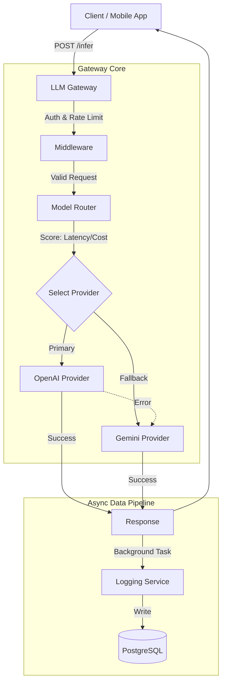

# LLM Inference Gateway 

**A High-Performance, Fault-Tolerant Gateway for LLM API Routing**


## Overview

The **LLM Inference Gateway** is a robust backend service designed to solve the challenges of relying on a single LLM provider. It acts as a unified interface for multiple AI models (OpenAI, Gemini), providing **smart routing**, **automatic fallbacks**, and **centralized analytics**.

Designed for resilience and scale, it ensures your AI applications stay online even when one provider goes down, while optimizing for cost and latency in real-time.

### Key Features

- **Fault Tolerance**: Automatically retries and switches providers if one fails (e.g., OpenAI outage -> Gemini fallback).
- **Smart Routing**: Dynamically selects the best provider based on weighted scores of **Latency (60%)** and **Cost (40%)**.
- **Async Performance**: Non-blocking inference pipeline with background logging to PostgreSQL.
- **Enterprise Security**: API Key authentication with bcrypt hashing, caching, and rate limiting.
- **Analytics**: Tracks token usage, latency, and cost per API key and provider.
- **Idempotency**: Prevents duplicate billing/processing for retried requests.

---

## Architecture



---

## Quick Start

### Prerequisites

- Python 3.12+
- PostgreSQL
- OpenAI & Gemini API Keys

### Installation

1.  **Clone the repository:**

    ```bash
    git clone https://github.com/shashankmk/llm-inference-gateway.git
    cd llm-inference-gateway
    ```

2.  **Set up Virtual Environment:**

    ```bash
    python3 -m venv venv
    source venv/bin/activate
    pip install -r requirements.txt
    ```

3.  **Configure Environment:**

    ```bash
    cp .env_example .env
    # Edit .env with your DATABASE_URL and API Keys
    ```

4.  **Run the Server:**
    ```bash
    uvicorn app.main:app --reload
    ```

---

## API Reference

### 1. Smart Inference

**POST** `/infer`

Delegates the prompt to the best available provider.

```bash
curl -X POST http://localhost:8000/infer \
  -H "Content-Type: application/json" \
  -H "X-API-Key: YOUR_API_KEY" \
  -d '{
    "model": "auto",
    "prompt": "Explain quantum computing in one sentence.",
    "max_tokens": 50
  }'
```

**Response:**

```json
{
  "output": "Quantum computing uses quantum bits...",
  "provider": "gemini",
  "latency_ms": 145.2,
  "cost": 0.000015
}
```

### 2. Analytics (Admin)

**GET** `/analytics/usage-by-key`

Returns usage statistics grouped by API key.

```bash
curl -H "Authorization: Bearer ADMIN_JWT" http://localhost:8000/analytics/usage-by-key
```

---

## Testing

Run duplicate request protection test:

```bash
python scripts/verify_idempotency.py
```

Run load test (simulated):

```bash
python load_test.py
```

---

##  Scalability

- **Database**: Uses connection pooling (SQLAlchemy) and async drivers (`asyncpg`) to handle high concurrency.
- **Caching**: In-memory LRU cache for API key validation (can be swapped for Redis).
- **Stateless**: The application is stateless and can be horizontally scaled behind a load balancer (Nginx/AWS ALB).

---

## Author

**Shashank MK**  
_Backend Engineer | AI Platforms_
